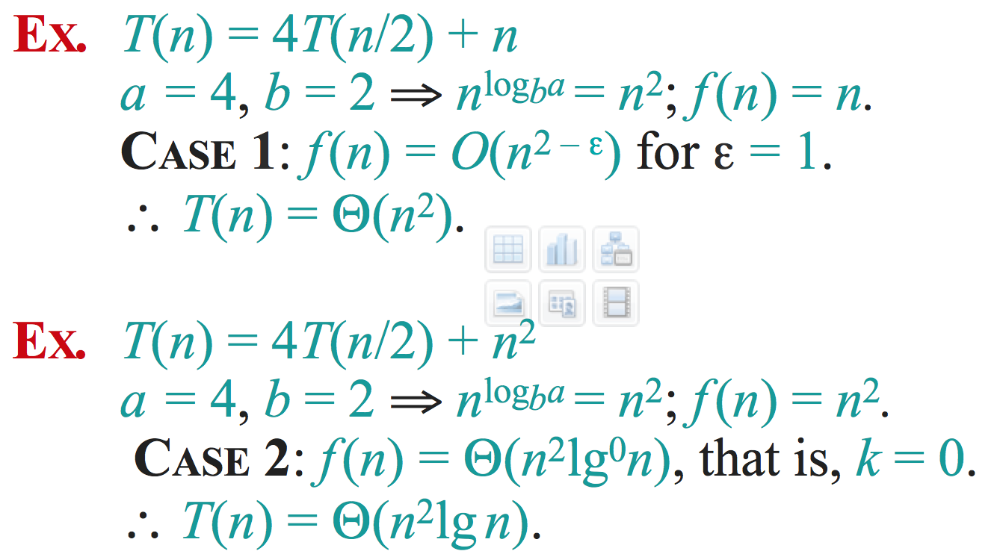
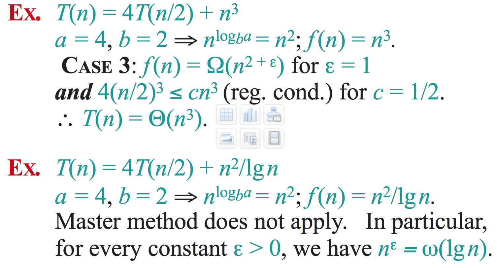

SOLID:
- Single responsibility principle
- Open close principle: open to extension, close to modification
- Liskov substitution principle: subclass can replace parent class
- Interface segregation principle
- Dependency inversion principle

5C template
- Clarify
  * what: use keywords to ask questions
  * how
  * who
- Core object
- Cases
- Classes
- Correctness

[OOD UML access modifier](http://javajee.com/important-uml-diagrams-required-to-work-with-design-patterns)
- \~ default
- \+ public
- \- private
- \# protected

## Master theorem



## jiuzhang advanced algorithm
### Chapter 1
- moving window with two pointer
  * The core of these questions are
    + `how to check the valid state efficiently`
    + maintain a consistent state
      - if the state is not valid at the beginning `find a valid state in while loop`
      - if the state is valid at the beginning `keep a valid state through out the for & while loop`
        ```java
        int ans = Integer.MAX_VALUE;
        for (int lo = 0, hi = 0, sum = 0; lo < nums.length; lo++){
            while (sum < s && hi < nums.length){
                sum += nums[hi++];
            }
            if (sum >= s){
                ans = Math.min(ans, hi - lo);
            }
            sum -= nums[lo];
        }
        return ans == Integer.MAX_VALUE ? -1 : ans;
        ```
  * [406. Minimum Size Subarray Sum](http://www.lintcode.com/en/problem/minimum-size-subarray-sum/)
    + valid condition: `sum >= s`
  * [32. Minimum Window Substring](http://www.lintcode.com/en/problem/minimum-window-substring/)
    + valid condition `validLen >= target.length()`
  * [384. Longest Substring Without Repeating Characters](http://www.lintcode.com/en/problem/longest-substring-without-repeating-characters/)
    + valid condition `map[cur] == false`
  * [386. Longest Substring with At Most K Distinct Characters](http://www.lintcode.com/en/problem/longest-substring-with-at-most-k-distinct-characters/)
    + `always keep hi pointing to a valid state in the while loop`
- Kth Smallest Number in Arrays / Matrix
  * `***`[401. Kth Smallest Number in Sorted Matrix](http://www.lintcode.com/en/problem/kth-smallest-number-in-sorted-matrix/)
    + hard: `divide & conquer`
    + tricky part: `return left;`
  * [543. Kth Largest in N Arrays](http://www.lintcode.com/en/problem/kth-largest-in-n-arrays/)
    + think about when k > average array length
    + naive pq method: `n * m * log(k)`
    + improve method: `n * m * log(m) + k * log(k)`
  * `***`[465. Kth Smallest Sum In Two Sorted Arrays](http://www.lintcode.com/en/problem/kth-smallest-sum-in-two-sorted-arrays/)
    + `visualize two arrays as a sorted matrix`


### Chapter 2 data structure part 1
- Union Find
  * [589. Connecting Graph](http://www.lintcode.com/en/problem/connecting-graph/)
  * `*`[590. Connecting Graph II](http://www.lintcode.com/en/problem/connecting-graph-ii/)
  * [591. Connecting Graph III](http://www.lintcode.com/en/problem/connecting-graph-iii/)
  * `**`[433. Number of Islands](http://www.lintcode.com/en/problem/number-of-islands/)
    + only have to look up the left and up
  * `***`[434. Number of Islands II](http://www.lintcode.com/en/problem/number-of-islands-ii/)
    + always remember `i * m + j`
    + how to handle sparse matrix when both n and m are extremely large: use hashmap instead of int array
  * [178. Graph Valid Tree](http://www.lintcode.com/en/problem/graph-valid-tree/)
  * `**`[477. Surrounded Regions](http://www.lintcode.com/en/problem/surrounded-regions/)
- Trie
  * [442. Implement Trie](http://www.lintcode.com/en/problem/implement-trie/)
  * `*`[473. Add and Search Word](http://www.lintcode.com/en/problem/add-and-search-word/)
  * `**`[132. Word Search II](http://www.lintcode.com/en/problem/word-search-ii/)
  * `***`[634. Word Squares](http://www.lintcode.com/en/problem/word-squares/)
    ```java
    class TrieNode{
        List<String> startWith;
        boolean hasWord;
    }
    ```

### Chapter 3 data structure part 2
- Heap
  * `***`[363. Trapping Rain Water](http://lintcode.com/en/problem/trapping-rain-water/)
    + mem O(n) using stack
    + mem O(1) using two pointers
  * `***`[364. Trapping Rain Water II](http://lintcode.com/en/problem/trapping-rain-water-ii/)
  * `**`[81. Data Stream Median](http://lintcode.com/en/problem/data-stream-median/)
  * `***`[360. Sliding Window Median](http://lintcode.com/en/problem/sliding-window-median/)
    + TreeSet.remove(obj) is O(n)
    + TreeSet.last() is O(1)
    + TreeSet.first() is O(1)
    + **Compare treeset element by both value and index**
- Stack
  * [12. Min Stack](http://www.lintcode.com/en/problem/min-stack/)
  * [40. Implement Queue by Two Stacks](http://www.lintcode.com/en/problem/implement-queue-by-two-stacks/)
  * **TODO**[126. Max Tree](http://www.lintcode.com/en/problem/max-tree/)
  * `*`[575. Expression Expand](http://www.lintcode.com/en/problem/expression-expand/)
  * `***`[122. Largest Rectangle in Histogram](http://www.lintcode.com/en/problem/largest-rectangle-in-histogram/)
    ```java
    Deque<Integer> deque = new ArrayDeque<>();
    for (int i = 0; i <= height.length; i++){
        int curVal = i == height.length? 0 : height[i];
        while (!deque.isEmpty() && curVal <= height[deque.peek()]){
            int h = height[deque.pop()];
            int w = deque.isEmpty() ? i : i - deque.peek() - 1;
            ans = Math.max(ans, h * w);
        }
        deque.push(i);
    }
    return ans;
    ```

### Chapter 4 binary search, linear scan
- binary search
  * `*`[75. Find Peak Element](http://www.lintcode.com/en/problem/find-peak-element/)
    ```java
    while (lo + 1 < hi){
      lo = mid
    }
    while (lo <= hi){
      lo = mid + 1
    }
    ```
  * `***`[390. Find Peak Element II](http://www.lintcode.com/en/problem/find-peak-element-ii/)
  * [586. Sqrt(x) II](http://www.lintcode.com/en/problem/sqrtx-ii/)
    + `double eps = 1e-12;`
  * `*`[183. Wood Cut](http://www.lintcode.com/en/problem/wood-cut/)
    + `boolean check(...)`
  * `***`[633. Find the Duplicate Number](http://www.lintcode.com/en/problem/find-the-duplicate-number/)
    + O(nlogn)
  * `**`[437. Copy Books](http://www.lintcode.com/en/problem/copy-books/)
  * `***`[617. Maximum Average Subarray](http://www.lintcode.com/en/problem/maximum-average-subarray/)
    ```java
    boolean valid(int[] nums, int k, double mid){
        int n = nums.length;
        double[] sum = new double[n + 1];
        double pre_min = 0;
        for (int i = 0; i < n; i++){
            sum[i + 1] = sum[i] + (nums[i] - mid);
            if (i >= k - 1){
                pre_min = Math.min(pre_min, sum[i + 1 - k]);
                if (sum[i + 1] - pre_min >= 0){
                    return true;
                }
            }
        }
        return false;
    }
    ```
- Sweep-Line
  * `*`[391. Number of Airplanes in the Sky](http://www.lintcode.com/en/problem/number-of-airplanes-in-the-sky/)
  * **TODO**`***`[131. Building Outline](http://www.lintcode.com/en/problem/building-outline/)
- Deque
  * `***`[362. Sliding Window Maximum](http://www.lintcode.com/en/problem/sliding-window-maximum/)

### Chapter 5 DP part 1
- rolling arrays
  * `*`[534. House Robber II](http://www.lintcode.com/en/problem/house-robber-ii/)
  * `*`[436. Maximal Square](http://www.lintcode.com/en/problem/maximal-square/)
  * [114. Unique Paths](http://www.lintcode.com/en/problem/unique-paths/)
  * **TODO**[110. Minimum Path Sum](http://www.lintcode.com/en/problem/minimum-path-sum/)
  * **TODO**[119. Edit Distance](http://www.lintcode.com/en/problem/edit-distance/)
- memorized search
  * [397. Longest Increasing Continuous Subsequence](http://www.lintcode.com/en/problem/longest-increasing-continuous-subsequence/)
  * [398. Longest Increasing Continuous subsequence II](http://www.lintcode.com/en/problem/longest-increasing-continuous-subsequence-ii/)
  * `**`[200. Longest Palindromic Substring](http://www.lintcode.com/en/problem/longest-palindromic-substring/)
  * `**`[191. Maximum Product Subarray](http://www.lintcode.com/en/problem/maximum-product-subarray/)

#### 144. Interleaving Positive and Negative Numbers


#### 390. [Find Peak Element II](http://www.lintcode.com/en/problem/find-peak-element-ii/)
[MIT lecture](http://courses.csail.mit.edu/6.006/spring11/lectures/lec02.pdf)
- find the peak value in A[x...][mid] and A[mid][y...]
- search near the peak value

#### 404. [Subarray Sum II](http://www.lintcode.com/en/problem/subarray-sum-ii/)
- **九章的答案松松垮垮，下标满天飞，感觉有错，而且也完全记不住**
- binary search
  ```java
  int find(int[] A, int len, int value) {
      if (A[len-1] < value )
          return len;

      int l = 0, r = len-1, ans = 0;
      while (l <= r) {
          int mid = (l + r) / 2;
          if (value <= A[mid]) {
              ans = mid;
              r = mid - 1;
          }  else
              l = mid + 1;
      }
      return ans;
  }
  ```

## jiuzhang dp
### Chapter 1
- what dp ask for?
  * count
  * min/max
  * true/false(exist or not)
    + OR
- four key component for dp
  * state definition
    + the last step
    + convert to subproblem
  * transition function
  * initial state and bound
  * correct computation sequence
- exercise
  * [669. Coin Change](http://www.lintcode.com/en/problem/coin-change/)
  * `*` [114. Unique Paths](http://www.lintcode.com/en/problem/unique-paths/)
  * [116. Jump Game](http://www.lintcode.com/en/problem/jump-game/)
  * `***` [191. Maximum Product Subarray](http://www.lintcode.com/en/problem/maximum-product-subarray/)
### Chapter 2
- exercise
  * [115. Unique Paths II](http://www.lintcode.com/en/problem/unique-paths-ii/)
  * [515. Paint House](http://www.lintcode.com/en/problem/paint-house/)
  * 

## By category
- [math](https://leetcode.com/tag/math/)
  * `*`[418. Integer to Roman](http://www.lintcode.com/en/problem/integer-to-roman/)
- matrix
  * `*`[161. Rotate Image](http://www.lintcode.com/en/problem/rotate-image/)
  * `**`[654. Sparse Matrix Multiplication](http://www.lintcode.com/en/problem/sparse-matrix-multiplication/)
    ```java
    for (int i = 0; i < n; i++) {
        for (int k = 0; k < t; k++) {
            if (A[i][k] == 0) {
                continue;
            }
            for (int p = 0; p < col.get(k).size(); p++) {
                int j = col.get(k).get(p);
                C[i][j] += A[i][k] * B[k][j];
            }
        }
    }
    ```
- linkedlist
  * `**`[141. Linked List Cycle](https://leetcode.com/problems/linked-list-cycle/description/)
    + remove head.next from the linkedlist: `head.next = head.next.next;`
  * [116. Populating Next Right Pointers in Each Node](https://leetcode.com/problems/populating-next-right-pointers-in-each-node/description/)
- **O(1) space**
- BFS
  * `**`[127. Word Ladder](https://leetcode.com/problems/word-ladder/description/)
    + [Two-end BFS](https://leetcode.com/problems/word-ladder/discuss/40711/Two-end-BFS-in-Java-31ms)
- q select
  * `***`[5. Kth Largest Element](http://www.lintcode.com/en/problem/kth-largest-element/)
    + `ThreadLocalRandom.current().nextInt(lo, hi + 1)`
    + There are two scenarios after the scan & swap
      - (hi) (lo)
        * hi and lo may be out of bound, so the value of num[hi], num[lo] is not useful at all
        * if hi and lo is in bound, num[hi]<=pivot, num[lo]>=pivot
      - (hi) (pivot) (lo)
        * if the index of pivot is k - 1, return pivot
- Sorting
  * **TODO**
- [Backtracking](http://www.lintcode.com/en/tag/backtracking/)
  * [135. Combination Sum](http://www.lintcode.com/en/problem/combination-sum/)
    + remove dup first
  * `***`[634. Word Squares](http://www.lintcode.com/en/problem/word-squares/)
- [Segment Tree](http://www.lintcode.com/en/tag/segment-tree/)
  * `*`[439. Segment Tree Build II](http://lintcode.com/en/problem/segment-tree-build-ii/)
  * `*`[247. Segment Tree Query II](http://lintcode.com/en/problem/segment-tree-query-ii/)
  * `*`[203. Segment Tree Modify](http://www.lintcode.com/en/problem/segment-tree-modify/)
  * `**` [207. Interval Sum II](http://www.lintcode.com/en/problem/interval-sum-ii/)
  * `***`[249. Count of Smaller Number before itself](http://www.lintcode.com/en/problem/count-of-smaller-number-before-itself/)
  * `**`[307. Range Sum Query - Mutable](https://leetcode.com/problems/range-sum-query-mutable/description/)
  * `**`[751. John's business](http://lintcode.com/en/problem/johns-business/)
- [Binary Indexed Trees | FenwickTree](https://www.topcoder.com/community/data-science/data-science-tutorials/binary-indexed-trees/)
  * `**`[307. Range Sum Query - Mutable](https://leetcode.com/problems/range-sum-query-mutable/description/)
    + https://www.youtube.com/watch?v=WbafSgetDDk
  * `***`[308. Range Sum Query 2D - Mutable](https://leetcode.com/problems/range-sum-query-2d-mutable/description/)
  * `***`[315. Count of Smaller Numbers After Self](https://leetcode.com/problems/count-of-smaller-numbers-after-self/description/)
    + https://www.youtube.com/watch?v=2SVLYsq5W8M
- DP
  * `**`[139. Word Break](https://leetcode.com/problems/word-break/description/)
  * `***`[494. Target Sum](https://leetcode.com/problems/target-sum/description/)
  * `**`[5. Longest Palindromic Substring](https://leetcode.com/problems/longest-palindromic-substring/description/)
    + [solution](https://leetcode.com/problems/longest-palindromic-substring/discuss/2921/Share-my-Java-solution-using-dynamic-programming)
- Manacher’s Algorithm
  * `***`[5. Longest Palindromic Substring](https://leetcode.com/problems/longest-palindromic-substring/description/)

## leetcode contest
- [Weekly Contest 68](https://leetcode.com/contest/weekly-contest-68/)
  * [766. Toeplitz Matrix](https://leetcode.com/contest/weekly-contest-68/problems/toeplitz-matrix/)
    ```java
    public boolean isToeplitzMatrix(int[][] matrix) {
        for (int i = 0; i < matrix.length - 1; i++) {
            for (int j = 0; j < matrix[i].length - 1; j++) {
                if (matrix[i][j] != matrix[i + 1][j + 1]) return false;
            }
        }
        return true;
    }
    ```
  * [767. Reorganize String](https://leetcode.com/contest/weekly-contest-68/problems/reorganize-string/)
  * [769. Max Chunks To Make Sorted (ver. 1)](https://leetcode.com/contest/weekly-contest-68/problems/max-chunks-to-make-sorted-ver-1/)
  * [768. Max Chunks to Make Sorted (ver. 2)](https://leetcode.com/contest/weekly-contest-68/problems/max-chunks-to-make-sorted-ver-2/)
    + Same solution for two problem: [Java solution, left max and right min.](https://discuss.leetcode.com/topic/117872/java-solution-left-max-and-right-min)
  * [770. Basic Calculator IV](https://leetcode.com/contest/weekly-contest-68/problems/basic-calculator-iv/)

- [Weekly Contest 69](https://leetcode.com/contest/weekly-contest-69)
  * `***`[773. Sliding Puzzle](https://leetcode.com/contest/weekly-contest-69/problems/sliding-puzzle/)
    + [construct the next permutation in lexicographic order](https://www.quora.com/How-would-you-explain-an-algorithm-that-generates-permutations-using-lexicographic-ordering)
      - Find the largest x such that P[x]<P[x+1].
        * (If there is no such x, P is the last permutation.)
      - Find the largest y such that P[x]<P[y].
      - Swap P[x] and P[y].
      - Reverse P[x+1 .. n].
      - [video demo](https://www.youtube.com/watch?v=goUlyp4rwiU)
    + `Permutation Encoding` copied from uwi
      ```java
      public int encPerm(int[] a){
          int n = a.length;
          int used = 0;
          int ret = 0;
          for(int i = 0;i < n;i++){
              ret = ret * (n - i) + a[i] - Integer.bitCount(used & ((1<<a[i]) - 1));
              used |= 1<<a[i];
          }
          return ret;
      }
      ```
    + `***`[My submission](https://leetcode.com/submissions/detail/138297283/): Runtime: 10 ms
    + [simple BFS implementation](https://discuss.leetcode.com/topic/118770/java-19ms-28-clean-lines-bfs-with-comment)
      ```java
      for (int sz = q.size(); sz > 0; --sz) {
      }
      ```
  * `**`[774. Minimize Max Distance to Gas Station](https://leetcode.com/contest/weekly-contest-69/problems/minimize-max-distance-to-gas-station/)
    + When you see the question accept an approximate result as the answer, you know it's `divide and conquer`
    ```java
    while (lo + 1e-6 < hi){}
    ```
- [Weekly Contest 70](https://leetcode.com/contest/weekly-contest-70/)
  * [779. K-th Symbol in Grammar](https://leetcode.com/contest/weekly-contest-70/problems/k-th-symbol-in-grammar/)
      - from uwi
      ```java
      class Solution {
    	    public int kthGrammar(int N, int K) {
    	        return Integer.bitCount(K-1)%2;
    	    }
    	}
      ```
- [Weekly Contest 71](https://leetcode.com/contest/weekly-contest-71)
  * [783. Minimum Distance Between BST Nodes](https://leetcode.com/contest/weekly-contest-71/problems/minimum-distance-between-bst-nodes/)
  * [781. Rabbits in Forest](https://leetcode.com/contest/weekly-contest-71/problems/rabbits-in-forest/)
  * `*`[780. Reaching Points](https://leetcode.com/contest/weekly-contest-71/problems/reaching-points/)
  * `***`[782. Transform to Chessboard](https://leetcode.com/contest/weekly-contest-71/problems/transform-to-chessboard/)

## lintcode contest
- [Weekly Contest 1](http://lintcode.com/contest/9/)
  * `**`[751. John's business](http://lintcode.com/en/problem/johns-business/)
    + segment tree
  * `**`[752. Rogue Knight Sven](http://lintcode.com/en/problem/rogue-knight-sven/)
- [Weekly Contest 2](http://lintcode.com/contest/10/)
  * [782. AND and OR](http://lintcode.com/en/problem/and-and-or/)
  * `***` [783. Minimum Risk Path](http://lintcode.com/en/problem/minimum-risk-path/)
    + 通过 Kruskal 算法，将含有位置 0 结点的子树和含有位置 n 结点的子树合并时的那条边的权值为答案。
    + UnionFind实际应用
- [Weekly Contest 3](http://lintcode.com/contest/11/)
  * `*`[792. Kth prime number](http://lintcode.com/en/problem/kth-prime-number/)
    + http://www.jiuzhang.com/solution/kth-prime-number/
- [Weekly Mock Interview Contest #6 (For Google Onsite)](http://lintcode.com/contest/15/)
  * `**`[826. Computer Maintenance](http://lintcode.com/en/problem/computer-maintenance/)
- [Weekly Mock Interview Contest #7 (For Bloomberg Onsite)](http://www.lintcode.com/contest/16/)
  * [830. String Sort](http://www.lintcode.com/en/problem/string-sort/)
    + `new String(str.chars().boxed().sorted(Comparator.comparing(p -> -set.get(p)[1]).thenComparing(p -> (int) p)).mapToInt(e -> e).toArray(), 0, n);`

## [Google](http://lintcode.com/problem/?tag=google&ordering=-frequency)
- [面筋](https://docs.google.com/document/d/191QbufdfYBF4fXPAtwJ4xQBPLgAcy2VsgHqBU9JncbM/mobilebasic)
- sorted by frequency
  * `***`[65. Median of two Sorted Arrays](http://lintcode.com/en/problem/median-of-two-sorted-arrays/)
    + reduce the problem little by little
  * `*`[134. LRU Cache](http://lintcode.com/en/problem/lru-cache/)
    + create two helper method:
      - void remove(Node node)
      - void insertAfter(Node node, Node cur)
  * [12. Min Stack](http://lintcode.com/en/problem/min-stack/)
  * [423. Valid Parentheses](http://lintcode.com/en/problem/valid-parentheses/)
  * [407. Plus One](http://lintcode.com/en/problem/plus-one/)
  * `**`[154. Regular Expression Matching](http://lintcode.com/en/problem/regular-expression-matching/)
    + TODO try solve it using dp
  * [116. Populating Next Right Pointers in Each Node](https://leetcode.com/problems/populating-next-right-pointers-in-each-node/description/)
    + You may only use constant extra space.
  * [299. Bulls and Cows](https://leetcode.com/problems/bulls-and-cows/description/)
    + need two pass
    ```java
    public String getHint(String sec, String g) {
        int n = sec.length(), bull = 0, cow = 0;
        int[] map = new int[128];
        for (int i = 0; i < n; i++){
            if (sec.charAt(i) == g.charAt(i)){
                bull++;
                continue;
            }
            if (map[sec.charAt(i)]++ < 0) cow++;
            if (map[g.charAt(i)]-- > 0) cow++;
        }
        return ""+bull+"A"+cow+"B";
    }
    ```
  * `*`Mastermind Game Design and how to guess the right solution
  * `**`[307. Range Sum Query - Mutable](https://leetcode.com/problems/range-sum-query-mutable/description/)
  * `***`[308. Range Sum Query 2D - Mutable](https://leetcode.com/problems/range-sum-query-2d-mutable/description/)
  * `**`[139. Word Break](https://leetcode.com/problems/word-break/description/)
  * 机器人那题
    + Node{
         boolean[] dires = new int[4];
         int number_of_travelled;
      }
    + number_of_travelled 存了一个Node走过多少次，每次机器人决定往哪里走的时候，走向那些node travelled较少的点
